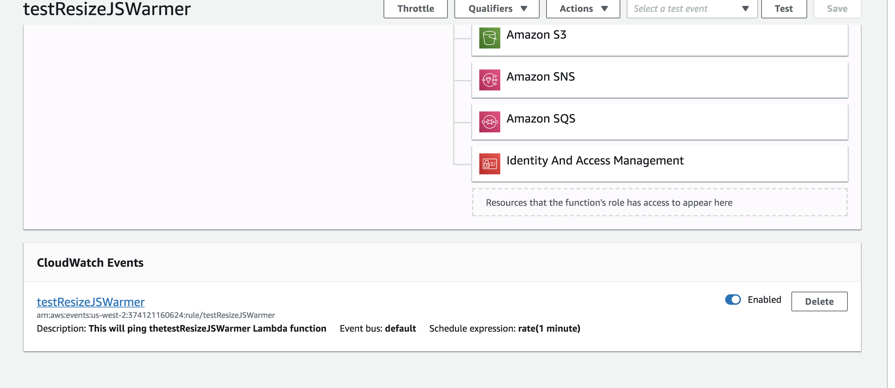

# Lambda Warmer resizeJs
Create a Lambda warmer with CloudWatch with Test

## Author
Liz Mahoney

## Getting Started

I followed a tutorial at:  https://read.acloud.guru/how-to-keep-your-lambda-functions-warm-9d7e1aa6e2f0

Go to IAM and Add CloudWatchEventFullAccess and CloudWatchLogFullAccess policies to existing Role from the same 
resizeJS Lambda function role.

Go to CloudWatch console and create a new Event, set to `Schedule` and for this case change `fixed rate` to `3` mins
Target the event to the `resizeJs` lambda function.

Once the event is created you sHould see the following page:

Go to the resizeJs Lambda console and scroll until you see CloudWatch Events to confirm it is attached:

Create a new lambda function to test the lambda warmer that was created. (the instructions is in the tutorial)

Once that is set up on the testResizeJSWarmer lambda function, click on `monitoring` tab then select `CloudWatch Logs`
 to view the 
test.

## Resources
https://read.acloud.guru/how-to-keep-your-lambda-functions-warm-9d7e1aa6e2f0

